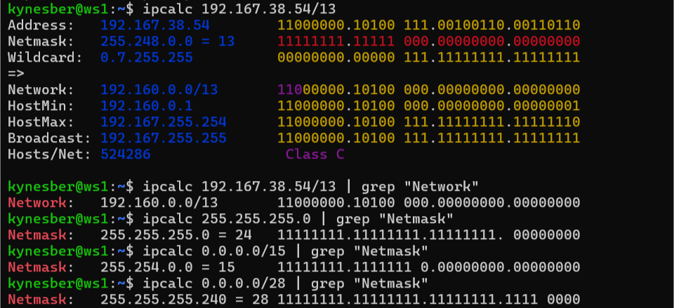
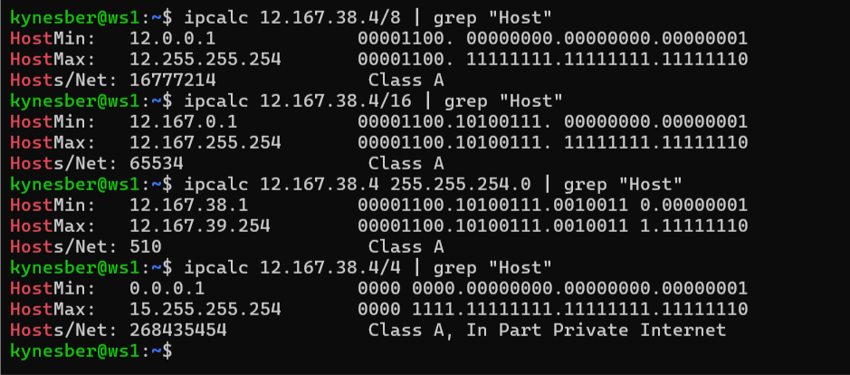
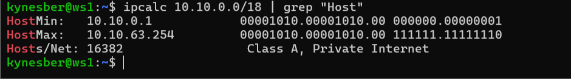
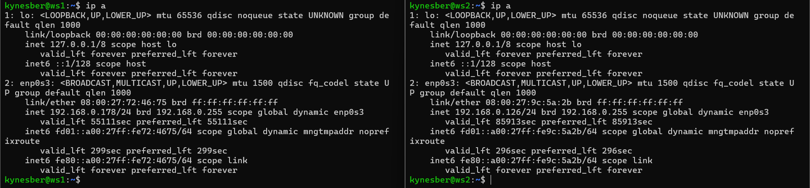
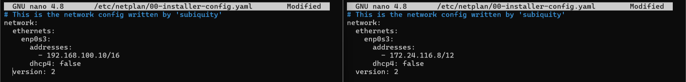

## Part 1. Инструмент ipcalc

**== Задание ==**

ipcalc - это утилита командной строки, которая позволяет выполнять различные вычисления, связанные с IP-адресами, включая определение адреса сети, широковещательного адреса, диапазона хостов и многое другое.

**Подними виртуальную машину (далее -- ws1)**

#### 1.1. Сети и маски

Маска подсети - 32-битное число, которое определяет, какая часть IP-адреса относится к адресу сети, а какая - к адресу хоста в этой сети.

**Определи и запиши в отчёт:**

**1) Адрес сети 192.167.38.54/13**

Адрес сети - IP-адрес, у которого биты хоста установлены в 0.

IP-адрес - уникальный идентификатор устройства в сети, использующий протокол IP. В версии IPv4 (которую мы рассматриваем) адрес состоит из 32 бит, обычно записывается в виде четырех десятичных чисел, разделенных точками.

**2) Перевод маски 255.255.255.0 в префиксную и двоичную запись, /15 в обычную и двоичную, 11111111.11111111.11111111.11110000 в обычную и префиксную**

Префиксная запись маски - краткая запись маски подсети в виде "/N", где N - количество единиц в двоичной записи маски (от 0 до 32).



**3) Минимальный и максимальный хост в сети 12.167.38.4 при масках: /8, 11111111.11111111.00000000.00000000, 255.255.254.0 и /4**



#### 1.2. localhost

localhost - специальный адрес (обычно 127.0.0.1), который указывает на текущий компьютер.

**Определи и запиши в отчёт, можно ли обратиться к приложению, работающему на localhost, со следующими IP: 194.34.23.100, 127.0.0.2, 127.1.0.1, 128.0.0.1**

Диапазон localhost - это вся сеть 127.0.0.0/8, которая включает все IP-адреса от 127.0.0.0 до 127.255.255.255. Из этого следует, что:

194.34.23.100 - нет

127.0.0.2 - да

127.1.0.1 - да

128.0.0.1 - нет

#### 1.3. Диапазоны и сегменты сетей

**Определи и запиши в отчёт:**

**1) Какие из перечисленных IP можно использовать в качестве публичного, а какие только в качестве частных: 10.0.0.45, 134.43.0.2, 192.168.4.2, 172.20.250.4, 172.0.2.1, 192.172.0.1, 172.68.0.2, 172.16.255.255, 10.10.10.10, 192.169.168.1**

Публичный IP-адрес - адрес, который может быть использован в Интернете.

Частный IP-адрес - адрес, который используется только в локальных сетях и не маршрутизируется в Интернете.

Диапазоны IP-адресов, которые зарезервированы для использования в локальных сетях и не маршрутизируются в глобальной сети Интернет определены в документе RFC 1918.

Основные диапазоны частных IP-адресов:

10.0.0.0/8 (от 10.0.0.0 до 10.255.255.255) — большой блок, содержащий около 16.7 миллионов адресов

172.16.0.0/12 (от 172.16.0.0 до 172.31.255.255) — средний блок, содержащий около 1 миллиона адресов

192.168.0.0/16 (от 192.168.0.0 до 192.168.255.255) — малый блок, содержащий около 65 тысяч адресов

10.0.0.45 - частный

134.43.0.2 - публичный

192.168.4.2 - частный

172.20.250.4 - частный

172.0.2.1 - публичный

192.172.0.1 - публичный

172.68.0.2 - публичный

172.16.255.255 - частный

10.10.10.10 - частный

192.169.168.1 - публичный

**2) Какие из перечисленных IP адресов шлюза возможны у сети 10.10.0.0/18: 10.0.0.1, 10.10.0.2, 10.10.10.10, 10.10.100.1, 10.10.1.255**

10.0.0.1 - нет

10.10.0.2 - да

10.10.10.10 - да

10.10.100.1 - нет

10.10.1.255 - да



## Part 2. Статическая маршрутизация между двумя машинами

**== Задание ==**

Статическая маршрутизация — это метод маршрутизации, при котором маршруты между сетями задаются администратором вручную, а не определяются автоматически с помощью протоколов динамической маршрутизации.

**Подними две виртуальные машины (далее -- ws1 и ws2).**

**С помощью команды ip a посмотри существующие сетевые интерфейсы.**

Сетевой интерфейс — физическое или виртуальное устройство, через которое компьютер взаимодействует с сетью.



**Опиши сетевой интерфейс, соответствующий внутренней сети, на обеих машинах и задать следующие адреса и маски: ws1 - 192.168.100.10, маска /16, ws2 - 172.24.116.8, маска /12.**

Для этого отредактируем файлы конфигураций netplan на обеих машинах.



**Выполни команду netplan apply для перезапуска сервиса сети.**

#### 2.1. Добавление статического маршрута вручную

**Добавь статический маршрут от одной машины до другой и обратно при помощи команды вида ip r add.**

**Пропингуй соединение между машинами.**

#### 2.2. Добавление статического маршрута с сохранением

**Перезапусти машины.**

**Добавь статический маршрут от одной машины до другой с помощью файла etc/netplan/00-installer-config.yaml.**

**Пропингуй соединение между машинами.**

## Part 3. Утилита iperf3

**== Задание ==**

#### 3.1. Скорость соединения

**Переведи и запиши в отчёт: 8 Mbps в MB/s, 100 MB/s в Kbps, 1 Gbps в Mbps.**

#### 3.2. Утилита iperf3

**Измерь скорость соединения между ws1 и ws2.**

## Part 4. Сетевой экран

**== Задание ==**

#### 4.1. Утилита iptables

**Создай файл /etc/firewall.sh, имитирующий фаерволл, на ws1 и ws2:**

```shell
#!/bin/sh

# Удаление всех правил в таблице «filter» (по-умолчанию).
iptables -F
iptables -X
```

**Нужно добавить в файл подряд следующие правила:**

**1) На ws1 примени стратегию, когда в начале пишется запрещающее правило, а в конце пишется разрешающее правило (это касается пунктов 4 и 5).**

**2) На ws2 примени стратегию, когда в начале пишется разрешающее правило, а в конце пишется запрещающее правило (это касается пунктов 4 и 5).**

**3) Открой на машинах доступ для порта 22 (ssh) и порта 80 (http).**

**4) Запрети echo reply (машина не должна «пинговаться», т.е. должна быть блокировка на OUTPUT).**

**5) Разреши echo reply (машина должна «пинговаться»).**

**Запусти файлы на обеих машинах командами chmod +x /etc/firewall.sh и /etc/firewall.sh.**

#### 4.2. Утилита nmap

**Командой ping найди машину, которая не «пингуется», после чего утилитой nmap покажи, что хост машины запущен.**

**Сохрани дампы образов виртуальных машин**

## Part 5. Статическая маршрутизация сети

**== Задание ==**

**Подними пять виртуальных машин (3 рабочие станции (ws11, ws21, ws22) и 2 роутера (r1, r2)).**

#### 5.1. Настройка адресов машин

**Настрой конфигурации машин в etc/netplan/00-installer-config.yaml согласно сети на рисунке.**

**Перезапусти сервис сети. Если ошибок нет, то командой ip -4 a проверь, что адрес машины задан верно. Также пропингуй ws22 с ws21. Аналогично пропингуй r1 с ws11.**

#### 5.2. Включение переадресации IP-адресов

**Для включения переадресации IP, выполни команду на роутерах:**

sysctl -w net.ipv4.ip_forward=1

При таком подходе переадресация не будет работать после перезагрузки системы.

**Открой файл /etc/sysctl.conf и добавь в него следующую строку:**

net.ipv4.ip_forward = 1

При использовании этого подхода, IP-переадресация включена на постоянной основе.

#### 5.3. Установка маршрута по-умолчанию

**Настрой маршрут по-умолчанию (шлюз) для рабочих станций. Для этого добавь default перед IP роутера в файле конфигураций.**

**Вызови ip r и покажи, что добавился маршрут в таблицу маршрутизации.**

**Пропингуй с ws11 роутер r2 и покажи на r2, что пинг доходит. Для этого используй команду:**

tcpdump -tn -i eth0

#### 5.4. Добавление статических маршрутов

**Добавь в роутеры r1 и r2 статические маршруты в файле конфигураций.**

**Вызови ip r и покажи таблицы с маршрутами на обоих роутерах.**

**Запусти команды на ws11:**

ip r list 10.10.0.0/[маска сети] и ip r list 0.0.0.0/0

#### 5.5. Построение списка маршрутизаторов

**Запусти на r1 команду дампа:**

tcpdump -tnv -i eth0

**При помощи утилиты traceroute построй список маршрутизаторов на пути от ws11 до ws21.**

#### 5.6. Использование протокола ICMP при маршрутизации

**Запусти на r1 перехват сетевого трафика, проходящего через eth0 с помощью команды:**

tcpdump -n -i eth0 icmp

**Пропингуй с ws11 несуществующий IP (например, 10.30.0.111) с помощью команды:**

ping -c 1 10.30.0.111

**Сохрани дампы образов виртуальных машин.**

## Part 6. Динамическая настройка IP с помощью DHCP

**== Задание ==**

**Для r2 настрой в файле /etc/dhcp/dhcpd.conf конфигурацию службы DHCP:**

**1) Укажи адрес маршрутизатора по-умолчанию, DNS-сервер и адрес внутренней сети.**

**2) В файле resolv.conf пропиши nameserver 8.8.8.8.**

**Перезагрузи службу DHCP командой systemctl restart isc-dhcp-server. Машину ws21 перезагрузи при помощи reboot и через ip a покажи, что она получила адрес. Также пропингуй ws22 с ws21.**

**Укажи MAC адрес у ws11, для этого в etc/netplan/00-installer-config.yaml надо добавить строки: macaddress: 10:10:10:10:10:BA, dhcp4: true.**

**Для r1 настрой аналогично r2, но сделай выдачу адресов с жесткой привязкой к MAC-адресу (ws11). Проведи аналогичные тесты.**

**Запроси с ws21 обновление ip адреса.**

**Сохрани дампы образов виртуальных машин.**

## Part 7. NAT

**== Задание ==**

**В файле /etc/apache2/ports.conf на ws22 и r1 измени строку Listen 80 на Listen 0.0.0.0:80, то есть сделай сервер Apache2 общедоступным.**

**Запусти веб-сервер Apache командой service apache2 start на ws22 и r1.**

**Добавь в фаервол, созданный по аналогии с фаерволом из Части 4, на r2 следующие правила:**

**1) Удаление правил в таблице filter - iptables -F;**

**2) Удаление правил в таблице "NAT" - iptables -F -t nat;**

**3) Отбрасывать все маршрутизируемые пакеты - iptables --policy FORWARD DROP.**

**Запусти файл также, как в Части 4.**

**Проверь соединение между ws22 и r1 командой ping.**

**Добавь в файл ещё одно правило:**

**4) Разрешить маршрутизацию всех пакетов протокола ICMP.**

**Запусти файл также, как в Части 4.**

**Проверь соединение между ws22 и r1 командой ping.**

**Добавь в файл ещё два правила:**

**5) Включи SNAT, а именно маскирование всех локальных ip из локальной сети, находящейся за r2 (по обозначениям из Части 5 - сеть 10.20.0.0).**

**6) Включи DNAT на 8080 порт машины r2 и добавить к веб-серверу Apache, запущенному на ws22, доступ извне сети.**

**Запусти файл также, как в Части 4.**

**Проверь соединение по TCP для SNAT: для этого с ws22 подключиться к серверу Apache на r1 командой:**

telnet [адрес] [порт]

**Проверь соединение по TCP для DNAT: для этого с r1 подключиться к серверу Apache на ws22 командой telnet (обращаться по адресу r2 и порту 8080).**

**Сохрани дампы образов виртуальных машин.**

## Part 8. Дополнительно. Знакомство с SSH Tunnels

**== Задание ==**

**Запусти на r2 фаервол с правилами из Части 7.**

**Запусти веб-сервер Apache на ws22 только на localhost (то есть в файле /etc/apache2/ports.conf измени строку Listen 80 на Listen localhost:80).**

**Воспользуйся Local TCP forwarding с ws21 до ws22, чтобы получить доступ к веб-серверу на ws22 с ws21.**

**Воспользуйся Remote TCP forwarding c ws11 до ws22, чтобы получить доступ к веб-серверу на ws22 с ws11.**

**Для проверки, сработало ли подключение в обоих предыдущих пунктах, перейди во второй терминал (например, клавишами Alt + F2) и выполни команду:**

telnet 127.0.0.1 [локальный порт]

**Сохрани дампы образов виртуальных машин.**